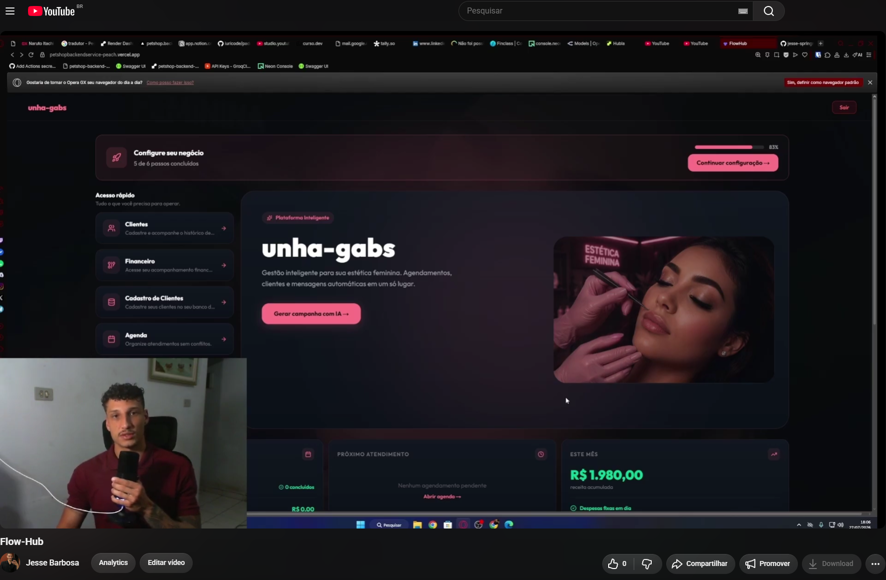

# 🐾 FlowHub

### SaaS Multi-Tenant de Gestão Inteligente para Negócios Locais

---

> ⚠️ **Este é um repositório de demonstração.**
> O FlowHub é um produto comercial em produção, atualmente em uso por negócios reais. Por esse motivo, o código-fonte é mantido em repositório privado. Aqui você encontra capturas de tela, vídeo demonstrativo e documentação técnica do projeto.
> Acesso ao código-fonte pode ser concedido mediante solicitação em processos seletivos — entre em contato pelos links no final desta página.

---

## 🎥 Vídeo Demonstrativo

<!-- Substitua pelo link do vídeo no YouTube (não listado) -->

_Clique na imagem para assistir ao fluxo completo: login, agenda, financeiro e geração de mensagens com IA._

---

## 📸 Preview

### Dashboard

### Saúde Financeira Auto

### Saúde Financeira Estética Feminina

### Geração de Mensagens com IA

### Agenda Inteligente p/ Estética Feminina

### Detalhes dos Agendamentos do Dia

### Mobile

🔒 Todos os dados exibidos nos prints e vídeo são fictícios ou anonimizados. Nenhuma informação real de clientes é exposta neste repositório.

🚀 Sobre o Projeto

O FlowHub nasceu como uma solução real para um petshop (projeto original New-Pettz) e evoluiu para um SaaS multi-tenant completo, capaz de atender diferentes tipos de negócios locais — Petshops, Estéticas Automotivas e Estúdios de Estética Feminina — cada um operando em total isolamento de dados, com tema visual dinâmico e regras de negócio próprias.

Hoje o sistema está em uso ativo por negócios reais, gerenciando clientes, agenda, financeiro e comunicação via IA em uma única plataforma.

🏗️ Arquitetura
┌─────────────────────────────────────────────────┐
│                   FRONTEND                       │
│         Next.js 16 · TypeScript · Tailwind       │
│         Recharts · React Hot Toast               │
└──────────────────────┬──────────────────────────┘
                       │ REST API
┌──────────────────────▼──────────────────────────┐
│                   BACKEND                        │
│         NestJS · JWT Auth · Prisma ORM           │
│         PostgreSQL · Class Validator             │
└──────────────────────┬──────────────────────────┘
                       │
┌──────────────────────▼──────────────────────────┐
│                 INTEGRAÇÕES                      │
│         Groq API (LLaMA 3.1) · WhatsApp          │
└─────────────────────────────────────────────────┘
✨ Funcionalidades
🏢 Multi-Tenant
Isolamento completo por businessId extraído do JWT — nunca do frontend
Três tipos de commerce com tema visual dinâmico: PETSHOP, AUTOMOTIVE, FEMININE_AESTHETIC
Cada tenant tem seus próprios clientes, agendamentos, serviços e dados financeiros
💰 Módulo Financeiro Completo
KPIs em tempo real — receita, despesas, lucro, ticket médio e total de transações
Comparação com mês anterior — variação percentual em cada card
Gráfico de evolução de receita vs despesa e lucro líquido
Ranking de maiores receitas por categoria
Receita automática — ao concluir um agendamento, uma transação é criada automaticamente
Despesas fixas recorrentes com lançamento mensal controlado e regra anti-duplicata no banco
📅 Agenda Inteligente
Calendário mensal com visualização de ocupação por dia
Bloqueio de horários conflitantes
Gestão de status (Agendado → Concluído → Cancelado)
🧠 Painel de Insights Preditivos com IA

A funcionalidade mais avançada do FlowHub: um motor que cruza os dados operacionais do negócio e devolve recomendações acionáveis, priorizadas por impacto.

Como funciona:

Coleta e cruzamento de dados — o algoritmo varre o financeiro (receita, lucro, despesas), a base de clientes (retorno, inatividade) e a ocupação da agenda do tenant, isolando sempre por businessId.
Filtro de sinais relevantes — dos dados brutos, são extraídos os pontos com maior variação ou risco: queda de receita/lucro, despesas fora do padrão, clientes que não retornam há X dias, horários ociosos recorrentes.
Geração de insights via IA — os sinais filtrados alimentam a Groq API (LLaMA 3.1), que gera análises em linguagem natural categorizadas em Financeiro, Recuperação de Cliente e Sugestão de Campanha, cada uma com nível de prioridade (alta/média/baixa) e um plano de ação sugerido.
Ação direta a partir do insight — cada card já nasce com o próximo passo (ex: reengajar clientes específicos via WhatsApp, ajustar meta de lucro do mês), fechando o ciclo entre "descobrir o problema" e "agir sobre ele".
Verificação automática de resultado — um cron job diário (GitHub Actions) reprocessa os insights de recuperação de cliente já emitidos e verifica se a ação recomendada gerou o resultado esperado (o cliente voltou a agendar). O sistema não só sugere — ele acompanha se a sugestão funcionou.

💡 Diferente de um dashboard tradicional que só exibe números, o painel interpreta os números e devolve recomendações prontas para execução — o objetivo é que o dono do negócio não precise saber ler um gráfico para tomar a decisão certa.

🤖 IA & Mensagens
Geração de mensagens personalizadas via Groq API (LLaMA 3.1)
Prompts específicos por tipo de commerce e tipo de mensagem
Envio direto para o cliente via integração com WhatsApp
🛎️ Gestão de Serviços
CRUD de serviços por negócio, vinculados ao agendamento
Soft delete preserva histórico
📊 Dashboard Diário
Resumo do dia: agendamentos, concluídos, cancelados e receita realizada
Endpoint dedicado que agrega todos os dados em uma única requisição
👥 Gestão de Clientes
CRUD completo com dados do cliente, pet/veículo e histórico de atendimentos
🔐 Autenticação & Documentação
Login seguro com JWT (cookie HttpOnly + localStorage)
API documentada com Swagger
Responsivo — funciona em desktop, Android e iOS
🔐 Segurança & Boas Práticas
businessId sempre extraído do JWT — nunca aceito do body, query param ou header
Validação com class-validator, DTOs tipados com whitelist: true e forbidNonWhitelisted: true
Separação de responsabilidades — Controller → Use Case → Prisma Service
RBAC com roles ADMIN, USER, SUPERADMIN e guards específicos
🧪 Testes

O projeto conta com testes unitários no backend (Jest) e frontend (Testing Library), além de uma suíte de testes E2E que sobe a aplicação real contra um banco de dados PostgreSQL efêmero provisionado no próprio runner do GitHub Actions — sem mocks de banco, só as chamadas a APIs externas (ex: Groq) são mockadas. Tudo integrado a um pipeline de CI/CD que valida a suíte completa a cada push na branch principal.

Destaques da suíte de testes:

Atomicidade do lançamento financeiro — garante rollback se a transação falhar
Regra anti-duplicata — impede lançamento duplo no mesmo mês
Isolamento multi-tenant — businessId sempre presente nas queries
Variação percentual de KPIs — cenários positivo, negativo e sem histórico
Fluxo completo de autenticação — login, cookie JWT httpOnly, acesso a rota protegida, cookie inválido, logout
Rate limiting no login — bloqueio após N tentativas na mesma janela, com header Retry-After
Ciclo completo do painel de insights — geração, persistência, cooldown de 24h e bypass forçado (force: true)
🔍 Desafios Técnicos Resolvidos

🍎 Safari iOS + Cross-Origin Cookies O Safari bloqueia cookies de domínios diferentes por política ITP. A solução foi usar localStorage + header Authorization para as requisições de API, e setar um cookie no mesmo domínio do frontend para o middleware conseguir ler.

⚙️ JWT Secret em produção A variável de ambiente do secret era lida antes do carregamento completo das envs no provedor de deploy. Solução: migração para carregamento assíncrono via ConfigService.

🔒 Middleware no Edge Runtime O middleware do Vercel roda no servidor — sem acesso a localStorage nem a cookies de outros domínios. Aprendizado: browser, middleware e API são três contextos completamente diferentes.

🏢 Isolamento Multi-Tenant Ao evoluir de single-tenant para multi-tenant, o maior risco era vazamento de dados entre negócios. Solução: businessId extraído exclusivamente do JWT em toda query, reforçado por testes que validam a presença do filtro em cada consulta.

💸 Consistência no Lançamento Financeiro Lançar uma despesa recorrente e criar a transação correspondente precisa ser atômico. Solução: transação de banco agrupando as duas operações, com constraint única garantindo que não haja lançamento duplicado no mesmo mês, mesmo sob concorrência.

🧠 Alucinação de IA em dados financeiros O maior risco de gerar insights com LLM em cima de dados financeiros é a alucinação — a IA "inventando" um número que não existe. A solução foi uma abordagem inspirada em RAG estruturado: a IA nunca acessa dados brutos nem faz cálculo algum — ela recebe um payload já processado e calculado pelo algoritmo (variação percentual de receita/despesa/lucro, clientes inativos, horários ociosos) e atua exclusivamente como camada de redação e contextualização em cima desses dados. O algoritmo calcula, a IA só redige. Essa separação foi reforçada com uma camada de guardrails no prompt de sistema, incluindo:

proibição explícita de calcular ou inventar qualquer número — usar exatamente os valores fornecidos;
limite de 1 insight por categoria (Financeiro, Recuperação de Cliente, Campanha), evitando ruído;
regras de formatação e tamanho (título ≤ 60 caracteres, descrição ≤ 280, sem numeração artificial);
proibição de sugerir descontos, preços ou canais de contato fora do WhatsApp;
tratamento de contexto informado pelo dono do negócio como dado de interpretação, nunca como instrução de sistema — mitigando prompt injection via input do usuário.

O resultado é um insight que soa "inteligente", mas onde a IA nunca tem autoridade sobre os números — só sobre o texto.

🧪 Testes E2E confiáveis em CI Testes E2E com banco mockado tendem a mascarar bugs reais de query, transação e constraint. A solução foi rodar a suíte E2E contra um PostgreSQL efêmero provisionado no próprio job do GitHub Actions — o banco sobe, recebe as migrations do Prisma, roda a suíte completa contra a aplicação real e é descartado ao final do job. Apenas integrações externas de terceiros (Groq API) são mockadas; toda a camada de persistência, autenticação e regras de negócio é testada contra um banco de verdade, capturando problemas que testes unitários isolados não pegariam — como falha de transação atômica ou constraint anti-duplicata sob concorrência.

⏱️ Fechando o loop da IA: o insight funcionou? Gerar uma recomendação é fácil; saber se ela funcionou é o que prova valor de verdade. Foi implementado um segundo workflow do GitHub Actions (Insights Recovery Outcomes Cron), agendado via cron para rodar diariamente, que chama um endpoint dedicado do backend e reprocessa os insights de recuperação de cliente emitidos anteriormente, verificando se a ação recomendada resultou em retorno do cliente. O endpoint é protegido por um header secreto (x-cron-secret) para não ficar exposto publicamente. Isso transforma o painel de insights de "gerador de sugestões" em um sistema que mede o próprio impacto.

🗄️ Modelagem de Dados (visão geral)
Business        → Plan · Commerce · Status
User            → Role (ADMIN | USER | SUPERADMIN)
Customer        → pets · vehicles · appointments
Appointment     → AppointmentStatus · transaction
Transaction     → TransactionType (INCOME | EXPENSE)
RecurringExpense → launches[]
Service         → price · active (soft delete)
🛠️ Stack Completa
Camada	Tecnologia
Frontend	Next.js 16, TypeScript, Tailwind CSS
Backend	NestJS, TypeScript
ORM	Prisma
Banco de dados	PostgreSQL (Neon)
Autenticação	JWT
Gráficos	Recharts
IA	Groq API (LLaMA 3.1-8b)
Testes	Jest, Testing Library
Validação	class-validator, class-transformer
Infra & DevOps	Vercel · Render · GitHub Actions (CI/CD) · Docker
📬 Contato

Interessado em conhecer o código-fonte, testar a plataforma ou conversar sobre o projeto?

Jessé Springman

GitHub · LinkedIn · E-mail

