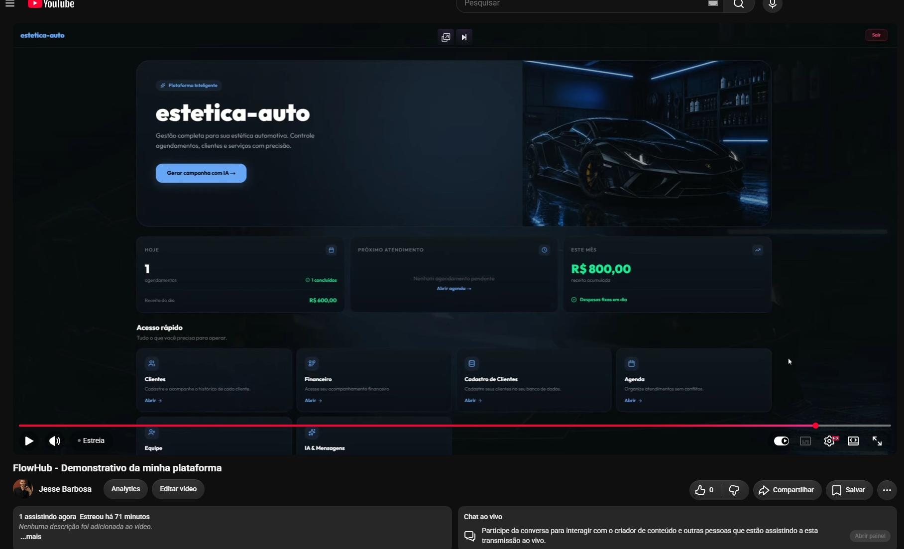
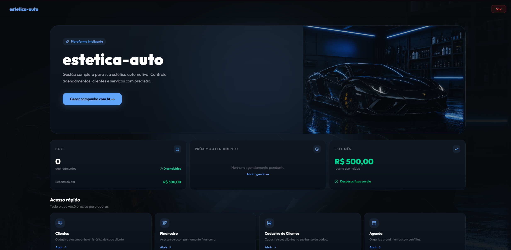
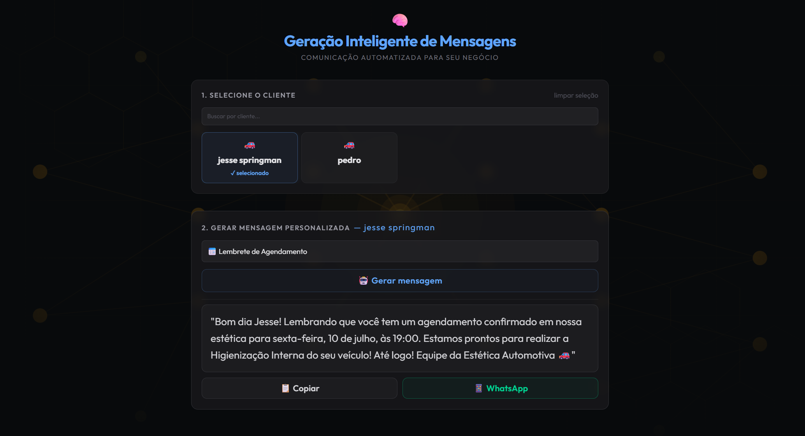
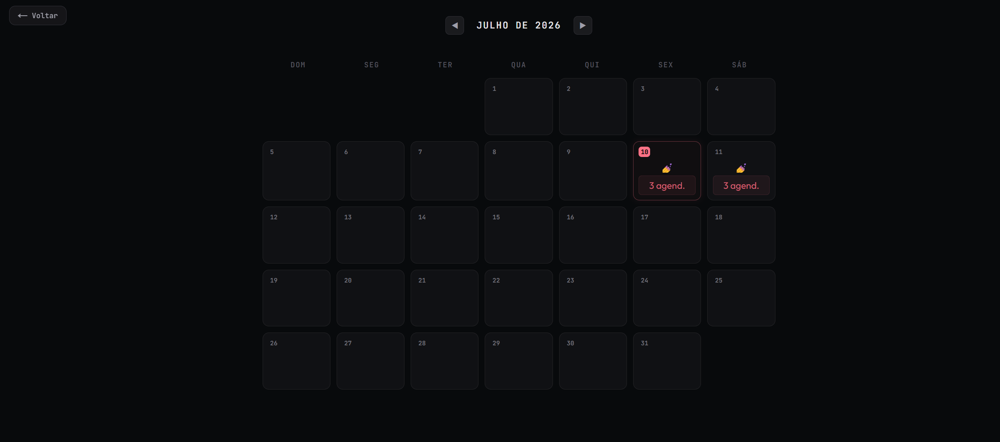
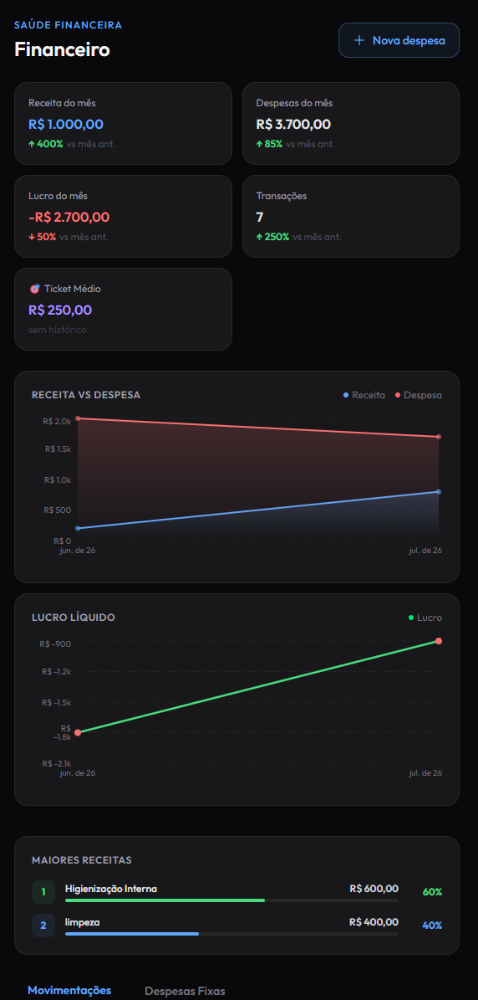

<div align="center">


# 🐾 FlowHub

### SaaS Multi-Tenant de Gestão Inteligente para Negócios Locais

[](https://nextjs.org/)
[](https://nestjs.com/)
[](https://www.typescriptlang.org/)
[](https://neon.tech/)
[](https://www.prisma.io/)
[](https://jestjs.io/)

</div>

---

> ⚠️ **Este é um repositório de demonstração.**
> O FlowHub é um produto comercial em produção, atualmente em uso por negócios reais. Por esse motivo, o código-fonte é mantido em repositório privado. Aqui você encontra capturas de tela, vídeo demonstrativo e documentação técnica do projeto.
> Acesso ao código-fonte pode ser concedido mediante solicitação em processos seletivos — entre em contato pelos links no final desta página.

---

## 🎥 Vídeo Demonstrativo

<div align="center">

<!-- Substitua pelo link do vídeo no YouTube (não listado) -->

[

[](https://youtu.be/l7IhFpaLox4)


_Clique na imagem para assistir ao fluxo completo: login, agenda, financeiro e geração de mensagens com IA._

</div>

---

## 📸 Preview

<div align="center">

### Dashboard



### Saúde Financeira Auto


### Saúde Financeira Estética Feminina


### Geração de Mensagens com IA



### Agenda Inteligente p/ Estética Feminina



### Detalhes dos Agendamentos do Dia


### Mobile



</div>

> 🔒 Todos os dados exibidos nos prints e vídeo são fictícios ou anonimizados. Nenhuma informação real de clientes é exposta neste repositório.

---

## 🚀 Sobre o Projeto

O **FlowHub** nasceu como uma solução real para um petshop (projeto original **New-Pettz**) e evoluiu para um **SaaS multi-tenant** completo, capaz de atender diferentes tipos de negócios locais — Petshops, Estéticas Automotivas e Estúdios de Estética Feminina — cada um operando em total isolamento de dados, com tema visual dinâmico e regras de negócio próprias.

Hoje o sistema está em uso ativo por negócios reais, gerenciando clientes, agenda, financeiro e comunicação via IA em uma única plataforma.

---

## 🏗️ Arquitetura

```
┌─────────────────────────────────────────────────┐
│                   FRONTEND                       │
│         Next.js 16 · TypeScript · Tailwind       │
│         Recharts · React Hot Toast               │
└──────────────────────┬──────────────────────────┘
                       │ REST API
┌──────────────────────▼──────────────────────────┐
│                   BACKEND                        │
│         NestJS · JWT Auth · Prisma ORM           │
│         PostgreSQL · Class Validator             │
└──────────────────────┬──────────────────────────┘
                       │
┌──────────────────────▼──────────────────────────┐
│                 INTEGRAÇÕES                      │
│         Groq API (LLaMA 3.1) · WhatsApp          │
└─────────────────────────────────────────────────┘
```

---

## ✨ Funcionalidades

### 🏢 Multi-Tenant

- Isolamento completo por `businessId` extraído do JWT — nunca do frontend
- Três tipos de commerce com tema visual dinâmico: **PETSHOP**, **AUTOMOTIVE**, **FEMININE_AESTHETIC**
- Cada tenant tem seus próprios clientes, agendamentos, serviços e dados financeiros

### 💰 Módulo Financeiro Completo

- KPIs em tempo real — receita, despesas, lucro, ticket médio e total de transações
- Comparação com mês anterior — variação percentual em cada card
- Gráfico de evolução de receita vs despesa e lucro líquido
- Ranking de maiores receitas por categoria
- Receita automática — ao concluir um agendamento, uma transação é criada automaticamente
- Despesas fixas recorrentes com lançamento mensal controlado e regra anti-duplicata no banco

### 📅 Agenda Inteligente

- Calendário mensal com visualização de ocupação por dia
- Bloqueio de horários conflitantes
- Gestão de status (`Agendado → Concluído → Cancelado`)

### 🤖 IA & Mensagens

- Geração de mensagens personalizadas via **Groq API (LLaMA 3.1)**
- Prompts específicos por tipo de commerce e tipo de mensagem
- Envio direto para o cliente via integração com WhatsApp

### 🛎️ Gestão de Serviços

- CRUD de serviços por negócio, vinculados ao agendamento
- Soft delete preserva histórico

### 📊 Dashboard Diário

- Resumo do dia: agendamentos, concluídos, cancelados e receita realizada
- Endpoint dedicado que agrega todos os dados em uma única requisição

### 👥 Gestão de Clientes

- CRUD completo com dados do cliente, pet/veículo e histórico de atendimentos

### 🔐 Autenticação & Documentação

- Login seguro com JWT (cookie HttpOnly + localStorage)
- API documentada com Swagger
- Responsivo — funciona em desktop, Android e iOS

---

## 🔐 Segurança & Boas Práticas

- `businessId` sempre extraído do JWT — nunca aceito do body, query param ou header
- Validação com `class-validator`, DTOs tipados com `whitelist: true` e `forbidNonWhitelisted: true`
- Separação de responsabilidades — Controller → Use Case → Prisma Service
- RBAC com roles `ADMIN`, `USER`, `SUPERADMIN` e guards específicos

---

## 🧪 Testes

O projeto conta com cobertura de testes unitários no backend (Jest) e frontend (Testing Library), integrados a um pipeline de CI/CD que valida todos os testes a cada push na branch principal.

**Destaques da suíte de testes:**

- Atomicidade do lançamento financeiro — garante rollback se a transação falhar
- Regra anti-duplicata — impede lançamento duplo no mesmo mês
- Isolamento multi-tenant — `businessId` sempre presente nas queries
- Variação percentual de KPIs — cenários positivo, negativo e sem histórico

---

## 🔍 Desafios Técnicos Resolvidos

**🍎 Safari iOS + Cross-Origin Cookies**
O Safari bloqueia cookies de domínios diferentes por política ITP. A solução foi usar `localStorage` + header `Authorization` para as requisições de API, e setar um cookie no mesmo domínio do frontend para o middleware conseguir ler.

**⚙️ JWT Secret em produção**
A variável de ambiente do secret era lida antes do carregamento completo das envs no provedor de deploy. Solução: migração para carregamento assíncrono via `ConfigService`.

**🔒 Middleware no Edge Runtime**
O middleware do Vercel roda no servidor — sem acesso a `localStorage` nem a cookies de outros domínios. Aprendizado: browser, middleware e API são três contextos completamente diferentes.

**🏢 Isolamento Multi-Tenant**
Ao evoluir de single-tenant para multi-tenant, o maior risco era vazamento de dados entre negócios. Solução: `businessId` extraído exclusivamente do JWT em toda query, reforçado por testes que validam a presença do filtro em cada consulta.

**💸 Consistência no Lançamento Financeiro**
Lançar uma despesa recorrente e criar a transação correspondente precisa ser atômico. Solução: transação de banco agrupando as duas operações, com constraint única garantindo que não haja lançamento duplicado no mesmo mês, mesmo sob concorrência.

---

## 🗄️ Modelagem de Dados (visão geral)

```
Business        → Plan · Commerce · Status
User            → Role (ADMIN | USER | SUPERADMIN)
Customer        → pets · vehicles · appointments
Appointment     → AppointmentStatus · transaction
Transaction     → TransactionType (INCOME | EXPENSE)
RecurringExpense → launches[]
Service         → price · active (soft delete)
```

---

## 🛠️ Stack Completa

| Camada         | Tecnologia                                        |
| -------------- | ------------------------------------------------- |
| Frontend       | Next.js 16, TypeScript, Tailwind CSS              |
| Backend        | NestJS, TypeScript                                |
| ORM            | Prisma                                            |
| Banco de dados | PostgreSQL (Neon)                                 |
| Autenticação   | JWT                                               |
| Gráficos       | Recharts                                          |
| IA             | Groq API (LLaMA 3.1-8b)                           |
| Testes         | Jest, Testing Library                             |
| Validação      | class-validator, class-transformer                |
| Infra & DevOps | Vercel · Render · GitHub Actions (CI/CD) · Docker |

---

## 📬 Contato

Interessado em conhecer o código-fonte, testar a plataforma ou conversar sobre o projeto?

<div align="center">

**Jessé Springman**

[GitHub](https://github.com/jesse-springman) · [LinkedIn](#) · [E-mail](#)

</div>
