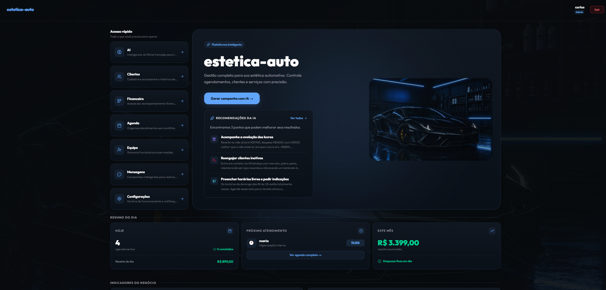
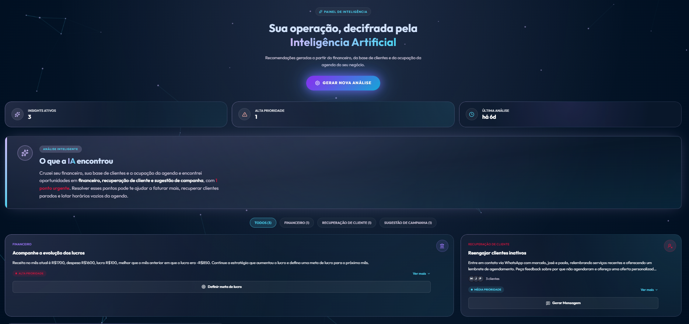
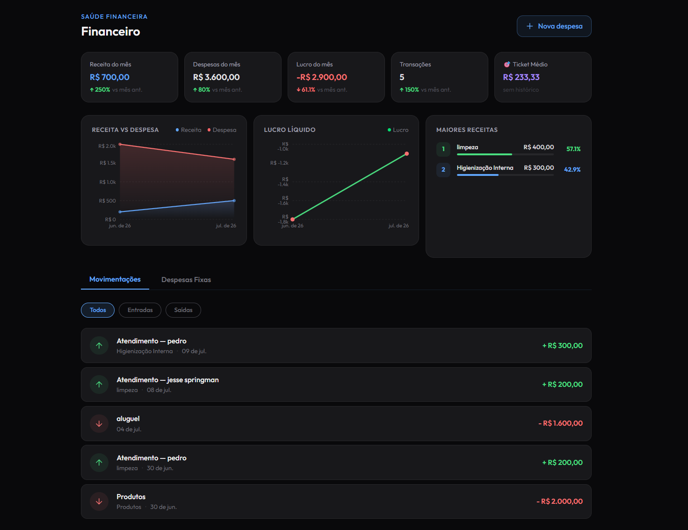
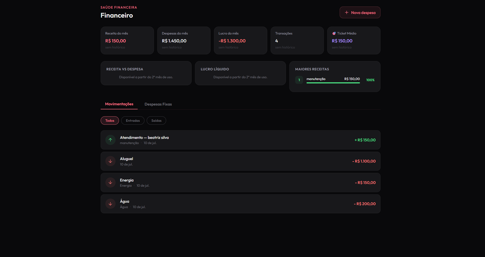
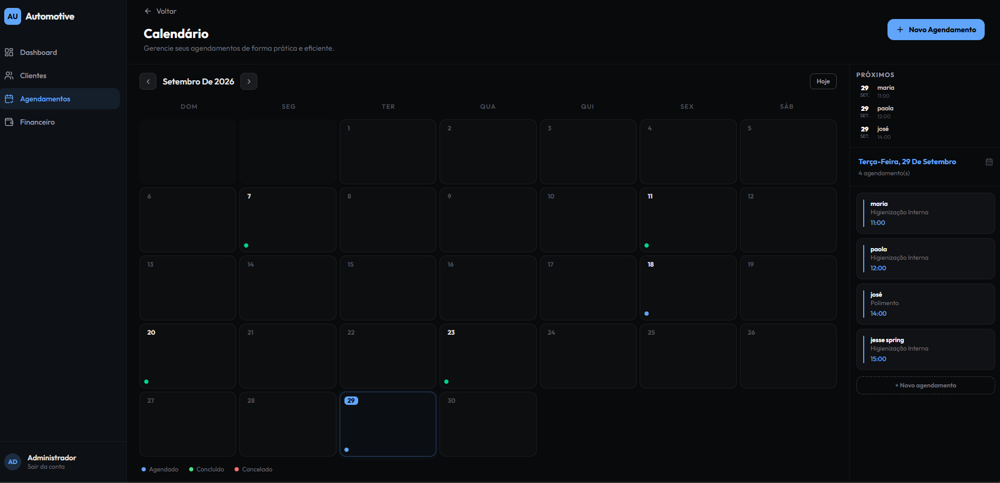
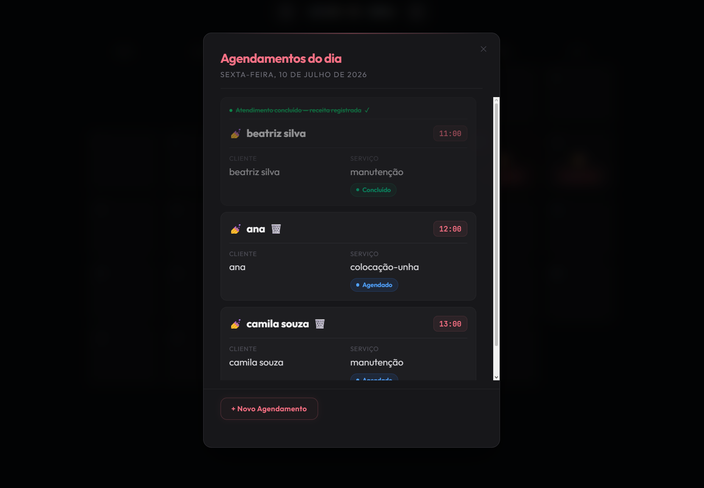
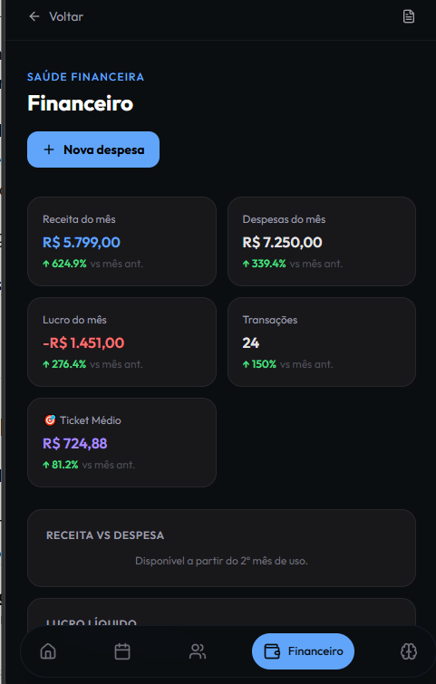

# 🎯 FlowHub

### Plataforma SaaS Multi-Tenant para Gestão de Negócios

Uma plataforma de gestão empresarial desenvolvida para centralizar clientes, agendamentos, financeiro e indicadores de negócio em um único sistema.

A FlowHub evoluiu de uma aplicação voltada para pet shops para uma solução multi-tenant, preparada para atender diferentes segmentos comerciais, com isolamento de dados, personalização por negócio e recursos de inteligência artificial.

<div align="center">

[🌐 Acessar demonstração](https://petshopbackendservice-peach.vercel.app/apresentacao) · [💻 GitHub](https://github.com/jesse-springman) · [📫 Contato](https://www.linkedin.com/in/jessé-springman-91180b171/)

</div>

---

## 📌 Sobre o projeto

A FlowHub é um projeto SaaS desenvolvido com foco em gestão e organização de negócios locais.

O sistema permite que diferentes empresas utilizem a mesma plataforma, mantendo seus dados e operações separados.

A aplicação foi construída com uma arquitetura modular, utilizando NestJS no backend, Next.js no frontend e PostgreSQL como banco de dados.

O projeto também conta com recursos financeiros, indicadores de desempenho e um painel de insights com inteligência artificial, que transforma dados calculados pelo sistema em recomendações práticas para o negócio.

### 🎯 Segmentos atendidos

* Pet shops
* Estéticas automotivas
* Estúdios de estética feminina

A estrutura permite adaptar a experiência e as funcionalidades conforme o segmento comercial.

---

## 🌐 Demonstração online

Acesse a página de apresentação para conhecer a plataforma e visualizar suas funcionalidades.

**[Acessar a FlowHub](https://petshopbackendservice-peach.vercel.app/apresentacao)**

> ⚠️ A demonstração utiliza hospedagem gratuita na Render. Como o serviço pode entrar em inatividade, o primeiro acesso pode levar alguns instantes para responder.

O código-fonte principal é mantido em repositório privado. Este repositório público apresenta o projeto, suas funcionalidades, arquitetura e demonstrações visuais.

---

## 📸 Interface da plataforma

As imagens abaixo apresentam algumas das principais funcionalidades da FlowHub.

### Dashboard e indicadores



Visão geral das informações do negócio, com indicadores e acompanhamento das atividades.


### 🧠 Insights com IA



O painel de Insights com IA da FlowHub transforma dados operacionais e financeiros em recomendações personalizadas para ajudar o gestor a identificar oportunidades e tomar decisões mais informadas.

A funcionalidade combina o processamento de dados do backend com inteligência artificial para analisar indicadores do negócio e gerar insights contextualizados.

**Principais recursos:**

* **Análise financeira:** identificação de variações de receita, despesas e lucro.
* **Recuperação de clientes:** identificação de clientes inativos e oportunidades de reengajamento.
* **Oportunidades de negócio:** sugestões relacionadas à ocupação da agenda e ao desempenho do estabelecimento.
* **Recomendações acionáveis:** insights organizados por categoria e prioridade, com sugestões de ações práticas.
* **Acompanhamento de resultados:** verificação de resultados de ações de recuperação de clientes por meio de rotinas automatizadas.

#### ⚙️ Como funciona

1. O backend processa os dados financeiros e operacionais do negócio.
2. Os indicadores e sinais relevantes são identificados por regras de negócio.
3. A IA recebe os dados previamente calculados e gera recomendações em linguagem natural.
4. Os insights são apresentados em cards, com informações sobre o problema identificado e possíveis ações.

A inteligência artificial atua na interpretação e contextualização dos dados, enquanto os cálculos financeiros permanecem sob responsabilidade do backend.

**Objetivo:** ajudar o gestor a entender o que está acontecendo no negócio e identificar oportunidades de melhoria sem precisar analisar manualmente todos os indicadores.


### Saúde financeira



Painel financeiro com indicadores de receita, despesas, lucro e desempenho do negócio.



Interface adaptada ao segmento de estética feminina.

### Gestão de agendamentos



Organização dos agendamentos e visualização da agenda conforme o segmento comercial.



Detalhamento dos atendimentos e informações dos agendamentos.

### Experiência mobile



Interface responsiva para utilização em dispositivos móveis.

> 🔒 Os dados apresentados nas imagens e demonstrações são fictícios ou anonimizados.

---

## ✨ Principais funcionalidades

### 🏢 Arquitetura Multi-Tenant

A FlowHub utiliza uma arquitetura multi-tenant, permitindo que diferentes negócios compartilhem a mesma aplicação.

* Isolamento de dados por `businessId`.
* Identificação do negócio a partir do contexto autenticado.
* Separação dos dados de clientes, serviços, agendamentos e financeiro.
* Personalização visual conforme o segmento comercial.
* Controle de acesso por perfil de usuário.

### 👥 Gestão de clientes

* Cadastro, edição e consulta de clientes.
* Histórico de atendimentos.
* Informações relacionadas a pets ou veículos, conforme o segmento.
* Organização dos dados por negócio.

### 📅 Agenda inteligente

* Visualização e gerenciamento de agendamentos.
* Controle de status dos atendimentos.
* Bloqueio de horários conflitantes.
* Organização da agenda por negócio.
* Detalhamento dos atendimentos do dia.

### 💰 Gestão financeira

* Controle de receitas e despesas.
* Indicadores de receita, despesas e lucro.
* Ticket médio e total de transações.
* Comparação de indicadores com períodos anteriores.
* Gráficos de evolução financeira.
* Despesas recorrentes.
* Registro automático de receita ao concluir um agendamento.

### 🧠 Insights de negócio com Inteligência Artificial

A FlowHub possui um painel de insights que utiliza inteligência artificial para interpretar indicadores do negócio e apresentar recomendações práticas.

O sistema identifica sinais relevantes nos dados operacionais e financeiros, como:

* Variações de receita, despesas e lucro.
* Clientes que estão há muito tempo sem retornar.
* Oportunidades de recuperação de clientes.
* Possíveis oportunidades de melhoria na ocupação da agenda.

A IA utiliza informações previamente processadas pelo backend para gerar insights contextualizados, com descrição, prioridade e sugestões de ação.

**O objetivo é transformar indicadores em informações úteis para a tomada de decisão**, ajudando o responsável pelo negócio a identificar oportunidades sem precisar interpretar manualmente todos os gráficos.

### 💬 Comunicação com clientes

* Utilização de templates de mensagens conforme a finalidade da comunicação.
* Estrutura preparada para diferentes tipos de negócio.
* Mensagens relacionadas a agendamentos e relacionamento com clientes.

### 📊 Dashboard operacional

* Resumo dos agendamentos do dia.
* Acompanhamento de atendimentos concluídos e cancelados.
* Informações financeiras do período.
* Agregação de indicadores para apresentação no dashboard.

---

## 🏗️ Arquitetura e tecnologias

A aplicação é dividida entre frontend, backend e serviços externos.

```text
                 FRONTEND
       Next.js · React · TypeScript
                    |
                 REST API
                    |
                 BACKEND
          NestJS · TypeScript
                    |
               Prisma ORM
                    |
                PostgreSQL
                    |
          SERVIÇOS E AUTOMAÇÕES
       Groq API · GitHub Actions
```

### Stack utilizada

| Camada                  | Tecnologias                        |
| ----------------------- | ---------------------------------- |
| Frontend                | Next.js, React, TypeScript         |
| Estilização             | Tailwind CSS                       |
| Backend                 | NestJS, TypeScript                 |
| Banco de dados          | PostgreSQL                         |
| ORM                     | Prisma                             |
| Autenticação            | JWT                                |
| Validação               | class-validator, class-transformer |
| Gráficos                | Recharts                           |
| Inteligência Artificial | Groq API                           |
| Testes                  | Jest, Testing Library              |
| Infraestrutura          | Vercel, Render, Neon               |
| DevOps                  | Docker, GitHub Actions             |

---

## 🔐 Segurança e boas práticas

O desenvolvimento da FlowHub envolve cuidados com segurança, organização e integridade dos dados.

* Autenticação baseada em JWT.
* Controle de acesso por perfil de usuário.
* Isolamento multi-tenant utilizando `businessId`.
* Validação de dados com DTOs.
* Separação de responsabilidades entre controllers, casos de uso e serviços.
* Organização modular do backend.
* Proteção contra consultas entre negócios diferentes.
* Transações de banco para operações financeiras que exigem atomicidade.
* Restrições no banco para evitar lançamentos duplicados.

---

## 🧪 Testes e CI/CD

O projeto possui testes automatizados para validar regras de negócio e comportamentos importantes da aplicação.

### Testes

* Testes unitários no backend com Jest.
* Testes de interface com Testing Library.
* Testes End-to-End utilizando PostgreSQL.
* Validação de regras financeiras.
* Testes de autenticação e autorização.
* Verificação do isolamento de dados entre negócios.

### Integração contínua

O projeto utiliza GitHub Actions para automatizar a execução dos testes.

O pipeline valida funcionalidades importantes da aplicação, utilizando um banco PostgreSQL provisionado durante a execução dos testes End-to-End.

Essa abordagem permite verificar o comportamento real da persistência de dados, das transações e das regras de negócio.

---

## ⏱️ Automações e tarefas agendadas

A FlowHub utiliza workflows agendados do GitHub Actions para executar rotinas periódicas relacionadas ao processamento e acompanhamento de insights.

Um dos processos verifica resultados de recomendações de recuperação de clientes, permitindo acompanhar se houve retorno após a ação sugerida.

Esse fluxo utiliza um endpoint protegido por segredo, evitando que a rotina de automação fique disponível para chamadas públicas sem autenticação.

---

## 🧠 Desafios técnicos

### Isolamento de dados em arquitetura multi-tenant

A evolução de uma aplicação inicialmente voltada para um único negócio exigiu uma estrutura capaz de atender múltiplas empresas sem misturar informações.

A solução utiliza `businessId` como parte do contexto de autenticação e das consultas ao banco de dados, reforçando o isolamento entre os negócios.

### Consistência das operações financeiras

Operações financeiras precisam preservar a integridade dos dados.

Foram utilizadas transações de banco e restrições de unicidade para evitar inconsistências e lançamentos duplicados em operações recorrentes.

### Confiabilidade dos insights gerados por IA

A inteligência artificial não é responsável por calcular os indicadores financeiros.

O backend processa os dados e calcula os indicadores antes de enviá-los à IA, que atua na interpretação e redação dos insights.

Essa separação reduz o risco de recomendações baseadas em valores inventados ou cálculos incorretos.

### Testes End-to-End com banco real

Para validar comportamentos importantes da aplicação, os testes End-to-End utilizam PostgreSQL em vez de simular toda a camada de persistência.

Isso permite verificar regras de negócio, consultas, transações e restrições do banco de dados em um ambiente mais próximo do funcionamento real.

---

## 🗺️ Roadmap

A FlowHub continua em evolução, com foco em ampliar sua infraestrutura e automatizar processos.

### Próximas etapas planejadas

* [ ] Migração da infraestrutura para VPS.
* [ ] Integração com gateway de pagamento para cobrança recorrente dos planos.
* [ ] Integração com a API oficial do WhatsApp Business Platform, da Meta.
* [ ] Automação de mensagens por templates aprovados.
* [ ] Evolução dos recursos de gestão e indicadores financeiros.
* [ ] Melhorias de monitoramento, disponibilidade e escalabilidade.

> Os itens acima representam objetivos futuros e não funcionalidades disponíveis na demonstração atual.

---

## 👨‍💻 Desenvolvedor

**Jessé Springman**

Desenvolvedor Backend / Full Stack, estudante de Análise e Desenvolvimento de Sistemas e criador da FlowHub.

Tenho foco em desenvolvimento backend com Node.js, NestJS, TypeScript e PostgreSQL, além de experiência com frontend, arquitetura de aplicações e integração de sistemas.

Este projeto representa minha evolução prática no desenvolvimento de software, desde a construção de APIs até a criação e evolução de uma plataforma SaaS.

### 📫 Contato

* [LinkedIn](https://www.linkedin.com/in/jessé-springman-91180b171/)
* [GitHub](https://github.com/jesse-springman)
* [Email](mailto:jessebarbosa45@gmail.com)

---

<div align="center">

**FlowHub — Transformando dados e processos em decisões melhores.**

</div>

